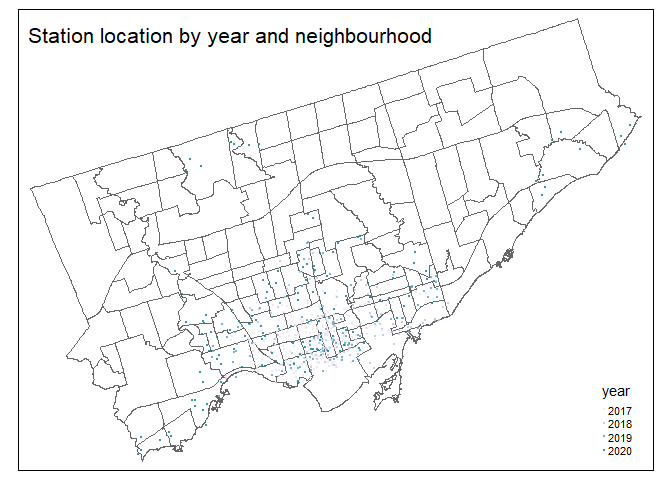
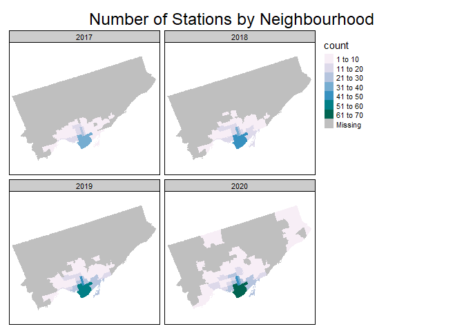
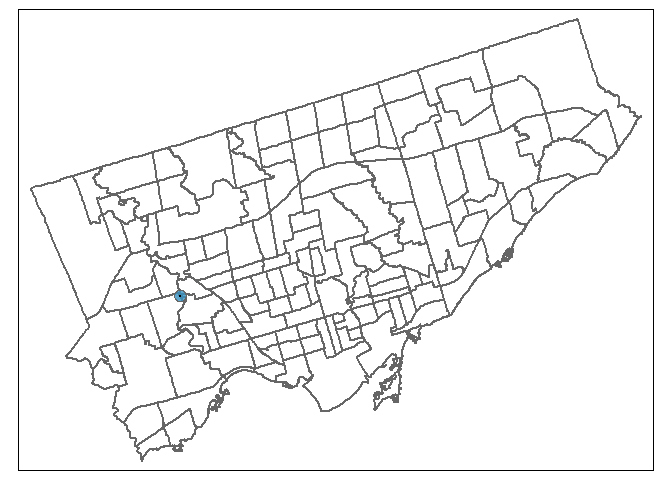
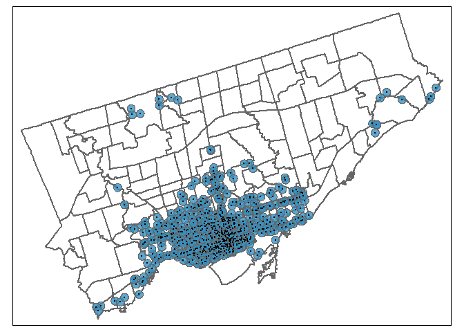
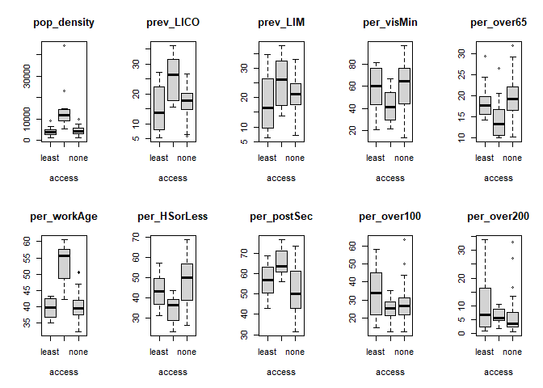

# Toronto Bike Share Access by Neighbourhood

When Toronto’s bike share program was introduced in 2011, it was concentrated in the downtown core [1](https://www.blogto.com/city/2011/05/bixi_bike-sharing_officially_launches_in_toronto/). The system’s first major expansion, which started  in 2015, focused on placing bikes near transit stations [2](https://www.thestar.com/news/gta/transportation/2015/07/06/bike-share-toronto-to-double-with-49-million-from-metrolinx.html ). The system has continued to grow in both size and popularity over the last 5 years [3](https://bikesharetoronto.com/news/2019-milestones/). 

In July 2019, Toronto City Council cemented the Bike Share program's role in the city’s transit infrastructure through the Cycling Network Plan [4](https://www.toronto.ca/services-payments/streets-parking-transportation/cycling-in-toronto/cycle-track-projects/cycling-network-10-year-plan/ ). Council directed transportation services to “work with Bike Share Toronto to develop a co-ordinated plan to install Bike Share infrastructure across Toronto” [5](http://app.toronto.ca/tmmis/viewAgendaItemHistory.do?item=2019.IE6.11).

This is a spatial analysis of Toronto’s bike share system to help inform where and how the Bike Share system should grow to best serve Torontonians? I explore how the system has changed between 2017 and 2020. How access varies by neighbourhood. And whether there is a relationship between proximity to this service and the social and economic characteristics of a neighbourhood.


## Data

The data for this project is available from the [Toronto Open Data Catalogue.](https://open.toronto.ca/)

I created a comprehensive list of Bike Share stations and their locations from two sources. The data for Bike Share Ridership includes the starting and ending station for each bike share trip over the course of the year. Usually it's used to understand usage patterns and volume. I used it to identify all the stations in the city for 2017, 2018 and 2019.  At the time of analysis, there is a full year of ridership data for each of those years.  The second source was the live feed of Bike Share system status.  Bike Share Toronto makes current system information available via API. I accessed the live feed on November 4, 2020 to create the list of bike share stations in 2020.  

Information about neighbourhoods and their characteristics was drawn from the [City of Toronto Neighbourhood Profiles](https://www.toronto.ca/city-government/data-research-maps/neighbourhoods-communities/neighbourhood-profiles/). The City developed a set of 140 neighbourhoods to help with local planning and research. The profiles include information from the census about population, education, identity and income. Information for each census tract in a neighbourhood is added together to generate the neighbourhood profile. The neighbourhood boundaries are constant, which allows for comparisons over time. For example, in the current analysis I explore how Bike Share station distribution varies across neighbourhoods over time. 


I started by mapping station locations and the borders of each neighbourhoods. The different colored dots indicate the year that the station was introduced to the system. Stations that have since been removed or moved are included in the analysis. At a glance you can see that the system is growing outwards overtime, but the majority of stations are in the downtown core.  There are also many neighbourhoods from the middle to the outer edges of the city that have no stations.

<!-- -->

## Descriptive statistics

The table below shows the total number of stations in each of the years of analysis. It also shows the smallest and largest number of stations per neighbourhood each year. The smallest number of stations is consistent over time, but the largest number of stations increased from 38 to 62. The number of neighbourhoods with no stations decreased over the last 4 years. In 2017, 70% of neighbourhoods had no Bike Share stations and in 2020, just under half of neighbourhoods were without a station. 


```
## # A tibble: 4 x 5
##    Year TotalStations SmallestNum LargestNum NoStations
##   <dbl>         <int>       <int>      <int>      <int>
## 1  2017           270           1         38        107
## 2  2018           364           1         47         98
## 3  2019           469           1         57         90
## 4  2020           608           1         62         69
```


The maps below show the number of stations per neighbour from 2017 (top, left) through 2020 (bottom, right). The number of neighbourhoods with a station increased each year. As did the concentration of stations, particularly in the downtown core. In general the system seems to be growing outwards from the Waterfront Communities and Bay Street Corridor neighbourhoods. In 2020, stations were added in the suburbs that are not connected to the rest of the system. One set of stations is near York University in the York University Heights neighbourhood. The second set of stations is spread across 5 neighbourhoods in Scarborough and is positioned near a GO commuter rail station and the Highland Creek trail. 

<!-- -->

## Access
Some Toronto neighbourhoods can be quite big, for example the Rouge and West Humber-Claireville neighbourhoods are both more than 30km^2^. While some communities can be quite small. North St. James Town, Regent Park, Playter Estates-Danforth and Blake-Jones are all less than 1 km^2^. So depending on where in the city you live, having a bike share station in your neighbourhood, doesn’t mean that it’s easy to access. 

For transportation purposes, walking distance is typically considered to be about 400m or a 5-minute walk [6](https://www.ncbi.nlm.nih.gov/pmc/articles/PMC3377942/). To approximate 400m of walking distance, I created a 400m circular buffer around each of the current bike share stations.  

With the addition of the buffer, Bike Share stations become “accessible” to even more neighbourhoods. In 2020, 71 neighbourhoods had a station, but 84 neighbourhoods were within walking distance of a station. Sometimes this occurs because of where the stations are placed. In the example below, you can see the station located at Scarlett Road and Eglinton Avenue West is near the border of four neighbourhoods. The walking distance buffer extends out and overlaps 4 neighbourhoods: Humber Heights-Westmount (where the station is located), Rockcliffe-Smythe, Edenbridge-Humber Valley, and Mount Dennis. 


<!-- -->

Of course not all the parts of each neighbourhood is within walking distance to a station. The Scarlett Road and Eglinton Avenue station is a good example of that. Only a small portion of each of the 4 adjacent neighbourhoods are within walking distance of the station. In contrast, the buffers for stations in the downtown core tend to overlap such that the neighbourhoods have full coverage. 

<!-- -->

I defined the coverage of a neighbourhood as the area in a neighbourhood covered by a Bike Station buffer divided by the total area of that neighbourhood. There are 11 neighbourhoods that currently have full coverage. In the 10 neighbourhoods with the least coverage between 0 to 4% of the neighbourhood area is within walking distance of a Bike Share station.  And as of 2020, 40% of the neighbourhoods in Toronto have no coverage at all. 


## Equity

The final section of the analysis compares the characteristics of neighbourhoods with the most, least and no coverage. Analysis from other cities has shown that bike share stations are often placed in neighbourhoods that already have socio-economic advantages [7,](https://www.uvm.edu/sites/default/files/media/TRC_Report_15-011.pdf) [8](https://www.urban.org/urban-wire/three-ways-bikeshare-can-counteract-not-reinforce-dcs-disparities). This may be an artifact of the demand analyses that are often used to assess the feasibility of introducing a Bike Share sytem.  When Bike Share stations are first introduced, they are often located in densely populated areas that are close to existing transit infrastructure or tourist attractions[9](https://www.researchgate.net/publication/241809163_Defining_a_Primary_Market_and_Estimating_Demand_for_Major_Bicycle-Sharing_Program_in_Philadelphia_Pennsylvania). The location of Toronto’s first stations and the initial expansion align with that approach. Assessing the characteristics of neighbourhoods with and without access to the current system, helps identify who the system is currently serving and gaps that could be filled in the future.

Julia Ursaki and Lisa Aultman-Hall compared areas inside and outside Bike Share service areas in six US cities.  They found that the areas differed significantly in race, income and education [7](https://www.uvm.edu/sites/default/files/media/TRC_Report_15-011.pdf).  To test whether there are similar social and economic differences in Toronto, I selected data from the Canadian census about identity, income and education. Some of these characteristics are known to influence bicycle use (e.g. population density, age)  [10](https://www.torontocycling.org/uploads/1/3/1/3/13138411/mapping_cycling_behaviour_in_toronto_final_23_may_printer_tl.pdf). Some factors are proxy measures for community advantage (e.g.,high income, post-secondary education) or disadvantage (e.g. visible minority, High School Diploma, Low Income Cut-Offs (LICO) and Low Income Measure (LIM)). 

I included two different measures of poverty in my analysis for comparative validity. The Low-Income Cut-Off (LICO) is an income cut-off below which families devote more of their income on necessities than the average family. But the cutoff was set in 1992 and may not be a good estimate of the cost or nature of today's ‘necessities’. The Low Income Measure is an income cut-off based on 50% of the income of a median household of the same number of persons. LIM is more current as it's based on the most recent census. But it's a more stringent definition of poverty that doesn't account for the different costs of living across the country.

I compared neighbourhoods on the following characteristics from Toronto’s Neighbourhood Census Profiles:

- Population density
- Percent visible minority population
- Percent over age 65
- Percent working age (25-55)
- Percent with up to a High School Diploma or Equivalency
- Percent with Post-Secondary Education
- Prevalence of Low Income (LICO)
- Prevalence of Low Income (LIM)
- Percent of households with income > $100,000
- Percent of households with income > $200,000


I compared three groups of neighbourhoods based on amount of Bike Share coverage. The three groups were: 

- Most Access (n=11)
- Least Access (n=10) 
- No Access (n=56)

100% of the neighbourhoods with the most access are within walking distance of a Bike Share station. Less than 4% of the neighbourhoods with the least access are within walking distance. The neighbourhoods with no access do not have a Bike Share station. The sample sizes are small and unequal, so I used a nonparametric Kruskal-Wallace test to compare the three groups. There were significant differences between the groups for 7 of the 10 characteristics. 
The boxplots below shows the distribution of the neighbourhood groups for each of the census characteristics. The black bar shows the mean for each group and the grey box is the interquartile range. You can see that neighbourhoods with the most access differ from one or both of the other neighbourhood groups for the following characteristics:

- population density
- prevalence of LICO
- percent visible minority
- percent over 65
- percent working age
- percent with a high school diploma or less
- percent with post-secondary education




Post-hoc Nemenyi tests show that neighbourhoods with the most access are more densely populated and have a lower prevalence of low-income (as measured by LICO) than the other two groups. In neighbourhoods with no access to Bike Share, a significantly higher percent of their population identify as a visibility minority compared to neighbourhoods with the most access. But neighbourhoods with minimal access don’t differ from the other groups on this characteristic. Age differentiated neighbourhoods with the most access from neighbourhoods with no access.  The percent of the population that is working age is higher in neighbourhoods with the most access. The percent of the population  over age 65 is higher in neighbourhoods with no access. In terms of education, the neighbourhoods with the most access have higher percent of people with postsecondary education and lower percent with high school diploma or less compared to neighbourhoods with no access.


```
##             var    kwStat kwDfree       kwPVal   sig
## 1   pop_density 24.449710       2 4.906964e-06  TRUE
## 2     prev_LICO 10.797319       2 4.522640e-03  TRUE
## 3      prev_LIM  3.414722       2 1.813438e-01 FALSE
## 4    per_visMin  8.484608       2 1.437444e-02  TRUE
## 5    per_over65  9.413649       2 9.033420e-03  TRUE
## 6   per_workAge 24.068369       2 5.937725e-06  TRUE
## 7  per_HSorLess 13.682429       2 1.068805e-03  TRUE
## 8   per_postSec 13.437940       2 1.207782e-03  TRUE
## 9   per_over100  2.088456       2 3.519635e-01 FALSE
## 10  per_over200  2.624841       2 2.691678e-01 FALSE
```

```
##                    var postHoc.least postHoc.most
## most...1   pop_density  0.0004155338           NA
## none...2   pop_density  0.9194186795 9.866855e-06
## most...3     prev_LICO  0.0175604639           NA
## none...4     prev_LICO  0.8001309667 8.934375e-03
## most...5    per_visMin  0.2216399780           NA
## none...6    per_visMin  0.8421563744 1.449417e-02
## most...7    per_over65  0.1860500217           NA
## none...8    per_over65  0.8298742984 9.108701e-03
## most...9   per_workAge  0.0006760862           NA
## none...10  per_workAge  0.9683848527 1.002048e-05
## most...11 per_HSorLess  0.2428394326           NA
## none...12 per_HSorLess  0.4109111621 1.440783e-03
## most...13  per_postSec  0.2545986342           NA
## none...14  per_postSec  0.4098827034 1.637751e-03
```


## Conclusion
Toronto’s bike share system has grown substantially over the last four years. The system has expanded into more neighbourhoods. And the concentration of stations in some neighbourhoods has increased as well. In nearly one-third of the city's neighbourhoods you can easily walk to a bike share station (i.e., neighbourhood coverage is > 50%). 

There are social and educational disparities between those with and without access to the Bike Share system in Toronto. These differences are consistent with findings from other cities. Neighbourhoods with the best access are less diverse, younger, and more educated than those without access. In contrast to other research, there wasn't a clear pattern of disparity between neighbourhoods across the measures of income. There were significant differences between the neighbourhoods for only 1 of the 2 measures of poverty and there weren't any differences in the percent of the population with high incomes.  

Overall, this analysis highlights a significant gap in equitable access to a low-cost and healthy for transportation in our city. The Bike Share system expansion is ongoing [5](https://www.toronto.ca/services-payments/streets-parking-transportation/cycling-in-toronto/cycle-track-projects/cycling-network-10-year-plan/). The city should consider equity in selecting new station locations. The city was successful with the downtown hub by expanding the system outward and growing stations on the periphery over time. The strategy for suburban communities may need to be different. The neighbourhoods with little or no access to the existing Bike Share network are more diverse and older than the neighbourhoods downtown. Bike Share Toronto should engage with those communities to select station locations and plan the roll-out in a way that meet the needs of those citizens. 

## References
1. Tse, J. (May 3, 2011). Bixi bike sharing officially launches in Toronto, BlogTO, accessed from: https://www.blogto.com/city/2011/05/bixi_bike-sharing_officially_launches_in_toronto/

2. Kalinowski, T. (July 6, 2015). Bike Share Toronto to double with $4.9 million from Metrolinx, Toronto Star, accessed from: https://www.thestar.com/news/gta/transportation/2015/07/06/bike-share-toronto-to-double-with-49-million-from-metrolinx.html

3. Bike Share Toronto. (January 2, 2020). 2019: A year of milestones for Bike Share Toronto, accessed from: https://bikesharetoronto.com/news/2019-milestones/

4. City of Toronto. Cycling Network Plan, accessed on November 4, 2020 from: https://www.toronto.ca/services-payments/streets-parking-transportation/cycling-in-toronto/cycle-track-projects/cycling-network-10-year-plan/

5. Toronto. City Council. Cycling Network Plan Update decision adopted on July 16, 17, and 18, 2019. Accessed from: http://app.toronto.ca/tmmis/viewAgendaItemHistory.do?item=2019.IE6.11

6. Yang, Y. & Diez-Roux, A.V. (July 2012). Walking distance by trip purpose and population subgroups. American Journal of Preventive Medicine, 43(1), pp. 11-19. 

7. Ursaki, J. & Aultman-Hall, L. (June 2015). Quantifying the equity of bike share access in US cities. (No. TRC Report 15-011). University of Vermont. Transportation Research Centre. 

8. Su, T., & Wang, R. (February 7, 2019). Three ways bike share can counteract, not reinforce, DC's disparities. Blog of the Urban Institue, access from: https://www.urban.org/urban-wire/three-ways-bikeshare-can-counteract-not-reinforce-dcs-disparities.

9. Krykewycz, G.R., et al. (December 2010). Defining a primary market and estimating demand for major bicycle-sharing progrma in Philadelphia, Pennsylvania. Transportation Research Record, 117-124.

10. Toronto Cycling Think & Do Tank. Mapping Cylcing Behaviour in Toronto. Access on November 4, 2020 from: https://www.torontocycling.org/uploads/1/3/1/3/13138411/mapping_cycling_behaviour_in_toronto_final_23_may_printer_tl.pdf.
